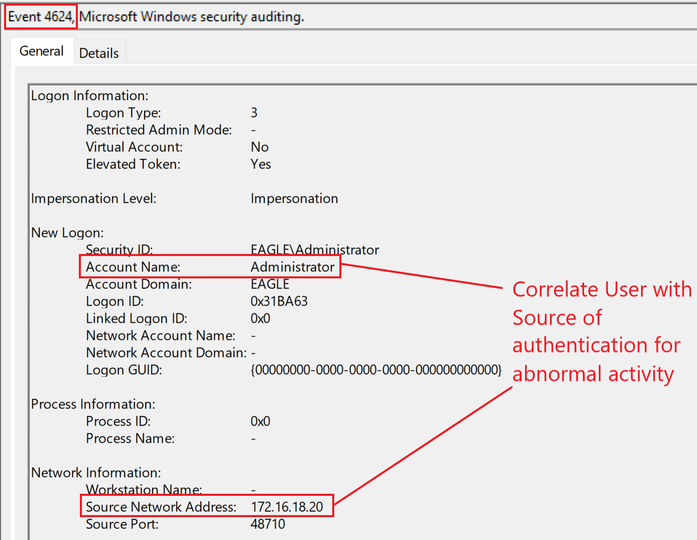

# windows_attack_defense
### Credentials in Shares
Credentials exposed in network shares are (probably) the most encountered misconfiguration in Active Directory to date. Any medium/large enterprises will undoubtedly have exposed credentials, although it may also happen in small businesses. It almost feels like we are moving from "Don't leave your password on a post-it note on your screen" to "Don't leave unencrypted credentials and authorization tokens scattered everywhere".

We often find credentials in network shares within scripts and configuration files (batch, cmd, PowerShell, conf, ini, and config). In contrast, credentials on a user's local machine primarily reside in text files, Excel sheets, or Word documents. The main difference between the storage of credentials on shares and machines is that the former poses a significantly higher risk, as it may be accessible by every user

The first step is identifying what shares exist in a domain. There are plenty of tools available that can achieve this, such as PowerView's Invoke-ShareFinder. This function allows specifying that default shares should be filtered out (such as c$ and IPC$) and also check if the invoking user has access to the rest of the shares it finds. 

```
Invoke-ShareFinder -domain eagle.local -ExcludeStandard -CheckShareAccess
```

Living of the Land ("LOTL")
Using findstr:
- /s forces to search the current directory and all subdirectories
- /i ignores case in the search term
- /m shows only the filename for a file that matches the term. We highly need this in real production environments because of the huge amounts of text that get returned. For example, this can be thousands of lines in PowerShell scripts that contain the PassThru parameter when matching for the string pass.
```
findstr /m /s /i "pass" *.ini
findstr /m /s /i "pass" *.ps1
findstr /m /s /i "net use" *.ps1
```
### Credentials in Shares Detection
Understanding and analyzing users' behavior is the best detection technique for abusing discovered credentials in shares. Suppose we know the time and location of users' login via data analysis. In that case, it will be effortless to alert on seemingly suspicious behaviors—for example, the discovered account 'Administrator' in the attack described above. If we were a mature organization that used Privileged Access Workstation, we would be alert to privileged users not authenticating from those machines. These would be alerts on event IDs 4624/4625 (failed and successful logon) and 4768 (Kerberos TGT requested).

Below is an example of a successful logon with event ID 4624 for the Administrator account:



**Tips:**
Another detection technique is discovering the one-to-many connections, for example, when Invoke-ShareFinder scans every domain device to obtain a list of its network shares. It would be abnormal for a workstation to connect to 100s or even 1000s of other devices simultaneously.
### Credentials in Shares Prevention
The best practice to prevent these attacks is to lock down every share in the domain so there are no loose permissions.

Technically, there is no way to prevent what users leave behind them in scripts or other exposed files, so performing regular scans (e.g., weekly) on AD environments to identify any new open shares or credentials exposed in older ones is necessary.

### Credentials in Shares honeypot
This attack provides another excellent reason for leaving a honeypot user in AD environments: a semi-privileged username with a wrong password. An adversary can only discover this if the password was changed after the file's last modification containing this exposed fake password. Below is a good setup for the account:

- A service account that was created 2+ years ago. The last password change should be at least one year ago.
- The last modification time of the file containing the fake password must be after the last password change of the account. Because it is a fake password, there is no risk of a threat agent compromising the account.
- The account is still active in the environment.
- The script containing the credentials should be realistic. (For example, if we choose an MSSQL service account, a connection string can expose the credentials.)

Because the provided password is wrong, we would primarily expect failed logon attempts. Three event IDs (4625, 4771, and 4776) can indicate this.