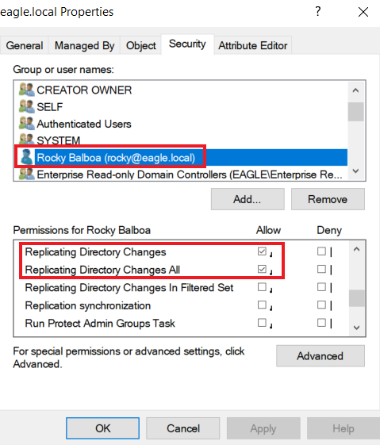
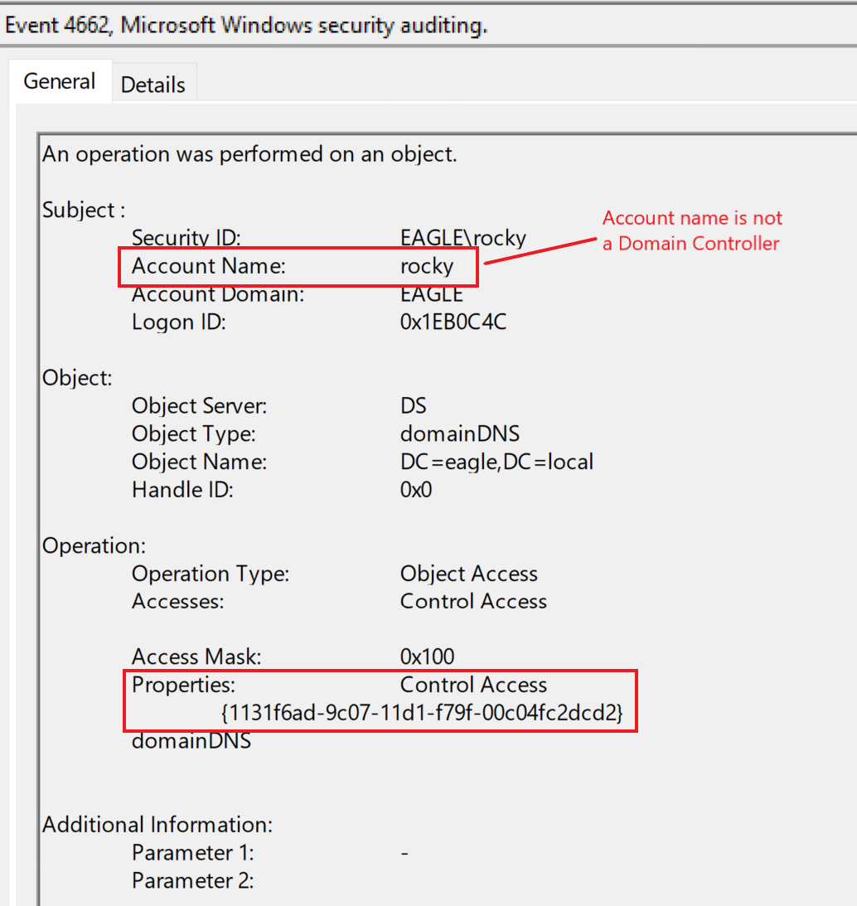

# windows_attack_defense
### DCSync Attack
DCSync is an attack that threat agents utilize to impersonate a Domain Controller and perform replication with a targeted Domain Controller to extract password hashes from Active Directory. The attack can be performed both from the perspective of a user account or a computer, as long as they have the necessary permissions assigned, which are:

- Replicating Directory Changes
- Replicating Directory Changes All

Her is an example of the user *rocky* having the *replicating directory changes* and *replicating directory changes all* set to *allow*.


This can be exploited through...
```
runas /user:eagle\rocky cmd.exe
```
Subsequently, we need to use Mimikatz, one of the tools with an implementation for performing DCSync. We can run it by specifying the username whose password hash we want to obtain if the attack is successful, in this case, the user 'Administrator':
```
lsadump::dcsync /domain:eagle.local /user:Administrator
```
It is possible to specify the /all parameter instead of a specific username, which will dump the hashes of the entire AD environment. We can perform pass-the-hash with the obtained hash and authenticate against any Domain Controller.

### DCSync Detection
Detecting DCSync is easy because each Domain Controller replication generates an event with the ID 4662 (An operation was performed on an object). We can pick up abnormal requests immediately by monitoring for this event ID and checking whether the initiator account is a Domain Controller.


Since replications occur constantly, we can avoid false positives by ensuring the followings:
- Either the property 1131f6aa-9c07-11d1-f79f-00c04fc2dcd2 or 1131f6ad-9c07-11d1-f79f-00c04fc2dcd2 is present in the event.
- Whitelisting systems/accounts with a (valid) business reason for replicating, such as Azure AD Connect (this service constantly replicates Domain Controllers and sends the obtained password hashes to Azure AD).

### DCSync Prevention
What DCSync abuses is a common operation in Active Directory environments, as replications happen between Domain Controllers all the time; therefore, preventing DCSync out of the box is not an option. The only prevention technique against this attack is using solutions such as the RPC Firewall, a third-party product that can block or allow specific RPC calls with robust granularity. For example, using RPC Firewall, we can only allow replications from Domain Controllers.

### DCSync Honeypot
However, suppose the honeypot user is the only account with Kerberos Pre-Authentication not required. In that case, there might be better detection methods, as it would be very obvious for advanced threat actors that it is a honeypot user, resulting in them avoiding interactions with it. (I did previously hear from an organization that needed one of these accounts (application related) that the 'security through obscurity' behind having only one of these accounts may save them, as attackers will avoid going after it thinking it is a honeypot user. While it may be true in some instances, we should not let a glimpse of hope dictate the security state of the environment.)