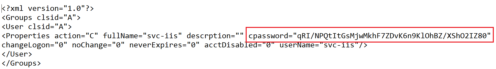
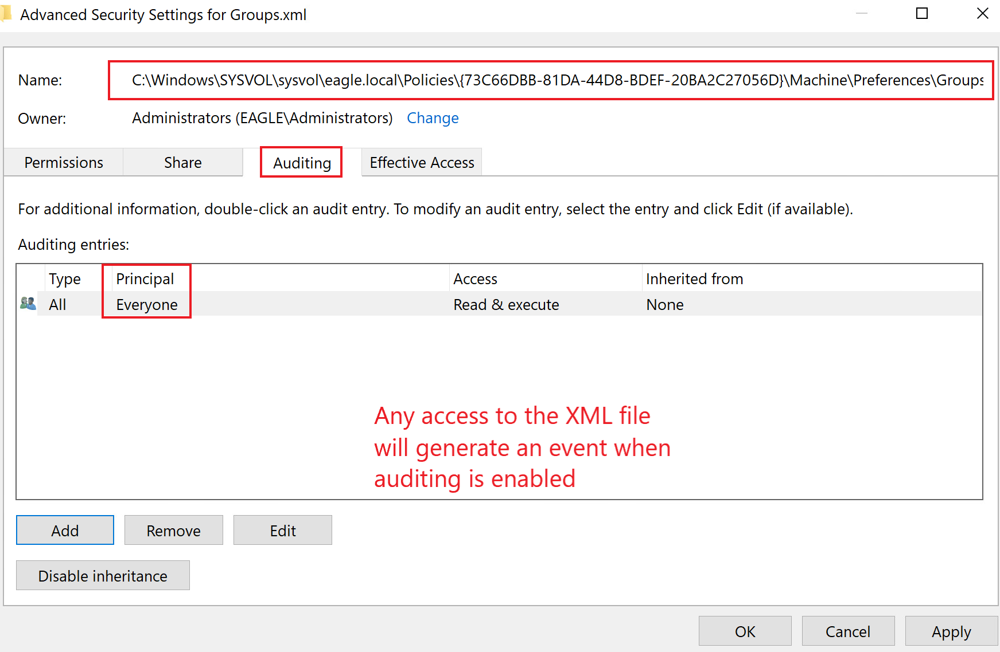

# windows_attack_defense
### Group Policy Preferences Passwords
SYSVOL is a network share on all Domain Controllers, containing logon scripts, group policy data, and other required domain-wide data. AD stores all group policies in \\<DOMAIN>\SYSVOL\<DOMAIN>\Policies\. When Microsoft released it with the Windows Server 2008, Group Policy Preferences (GPP) introduced the ability to store and use credentials in several scenarios, all of which AD stores in the policies directory in SYSVOL.

During engagements, we might encounter scheduled tasks and scripts executed under a particular user and contain the username and an encrypted version of the password in XML policy files. The encryption key that AD uses to encrypt the XML policy files (the same for all Active Directory environments) was released on Microsoft Docs, allowing anyone to decrypt credentials stored in the policy files. Anyone can decrypt the credentials because the SYSVOL folder is accessible to all 'Authenticated Users' in the domain, which includes users and computers. Microsoft published the AES private key on [MSDN](https://learn.microsoft.com/en-us/openspecs/windows_protocols/ms-gppref/2c15cbf0-f086-4c74-8b70-1f2fa45dd4be):

Also, as a reference, this is what an example XML file containing an encrypted password looks like (note that the property is called cpassword):


To abuse GPP Passwords, we will use the Get-GPPPassword function from PowerSploit, which automatically parses all XML files in the Policies folder in SYSVOL, picking up those with the cpassword property and decrypting them once detected:
```
Import-Modules .\Get-GPPPassword.ps1
Get-GPPPassword
```

### Group Policy Preferences Passwords Attack Detection
There is one detection techniques for this attack:

- Accessing the XML file containing the credentials should be a red flag if we are auditing file access; this is more realistic (due to volume otherwise) regarding detection if it is a dummy XML file, not associated with any GPO. In this case, there will be no reason for anyone to touch this file, and any attempt is likely suspicious. As demonstrated by Get-GPPPasswords, it parses all of the XML files in the Policies folder. For auditing. Once auditing is enabled, any access to the file will generate an Event with the ID 4663 (An attempt was made to access an object):


### Group Policy Preferences Passwords Attack Prevention
Once the encryption key was made public and started to become abused, Microsoft released a patch (KB2962486) in 2014 to prevent caching credentials in GPP. Therefore, GPP should no longer store passwords in new patched environments. However, unfortunately, there are a multitude of Active Directory environments built after 2015, which for some reason, do contain credentials in SYSVOL. It is therefore highly recommended to continuously assess and review the environment to ensure that no credentials are exposed here.

It is crucial to know that if an organization built its AD environment before 2014, it is likely that its credentials are still cached because the patch does not clear existing stored credentials (only prevents the caching of new ones).
